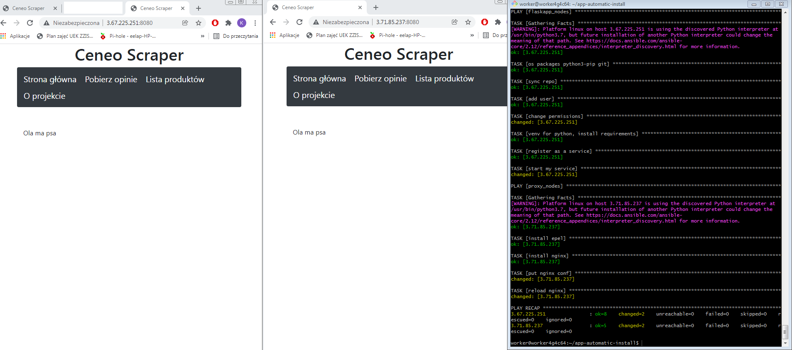

App automatic installation

How to:
1. Get your host/hosts where you want your app to be set up ready
2. Modify your hosts.ini file to include ip to the hosts you want.
3. run with command: "ansible-playbook setup.yml -i hosts.ini"
4. verify the app works by going to the page
5. profit

Launched ansible on private server cause sokrates was not working.

1. Will install pip for python3 and git on desired host/hosts.
2. Will clone/sync the repository specified in APP_REPO variable
3. Will change permissions
4. Will make sure Virtual Environment works correctly
5. Will register as a service
6. Will start the service